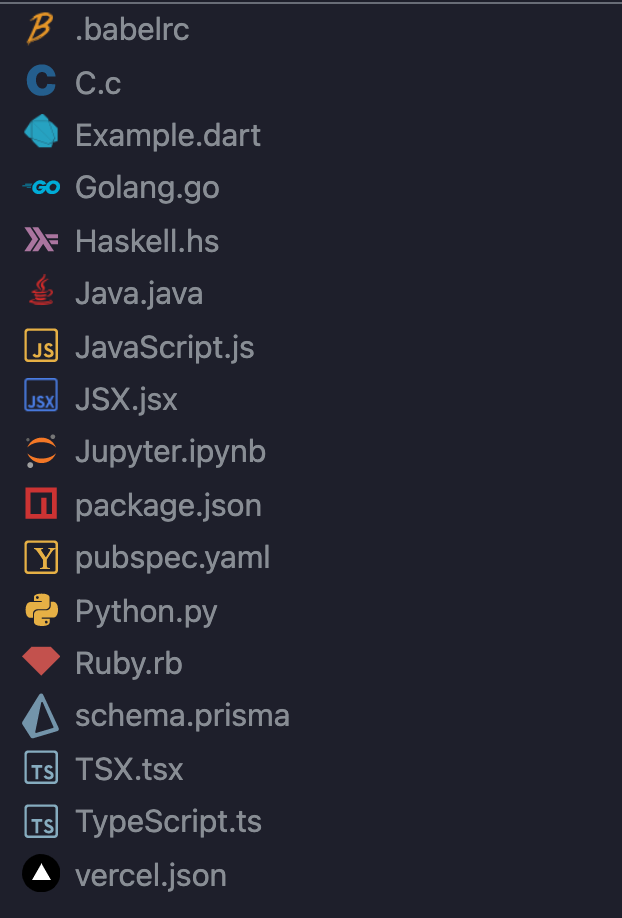

## Badges

.

# Mozart409 Icons

My personal choice of existing themes combined into one. Based on Ayu Icons with my own modifications and additions.

## Screenshots

## FAQ

#### Can I request more or other icons

Yes of course. Just open an issue or add an pull request

#### The theme seems like Ayu Icons

Yes this theme is based of them. Find the original [here](https://github.com/ayu-theme/vscode-ayu)

## Contributing

Contributions are always welcome!

See `contributing.md` for ways to get started.

Please adhere to this project's `code of conduct`.

## Roadmap

- Add more Icons

## License

[MIT](https://choosealicense.com/licenses/mit/)

## Authors

- [@Mozart409](https://www.github.com/mozart409)
